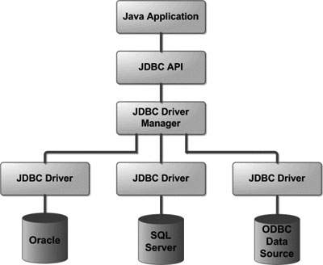

# JDBC Introduction

JDBC API is a Java API that can access any kind of tabular data, especially data stored in a Relational Database. JDBC works with Java on a variety of platforms, such as Windows, Mac OS, and the various versions of UNIX.

JDBC stands for Java Database Connectivity, which is a standard Java API for database-independent connectivity between the Java programming language and a wide range of databases.

The JDBC library includes APIs for each of the tasks mentioned below that are commonly associated with database usage.

* Making a connection to a database.
* Creating SQL or MySQL statements.
* Executing SQL or MySQL queries in the database.
* Viewing & Modifying the resulting records.

Fundamentally, JDBC is a specification that provides a complete set of interfaces that allows for portable access to an underlying database. Java can be used to write different types of executables, such as −

* Java Applications
* Java Applets
* Java Servlets
* Java ServerPages (JSPs)
* Enterprise JavaBeans (EJBs).

## JDBC Architecture
The JDBC API supports both two-tier and three-tier processing models for database access but in general, JDBC Architecture consists of two layers −

* JDBC API − This provides the application-to-JDBC Manager connection.
* JDBC Driver API − This supports the JDBC Manager-to-Driver Connection.

The JDBC API uses a driver manager and database-specific drivers to provide transparent connectivity to heterogeneous databases.

The JDBC driver manager ensures that the correct driver is used to access each data source. The driver manager is capable of supporting multiple concurrent drivers connected to multiple heterogeneous databases.

Following is the architectural diagram, which shows the location of the driver manager with respect to the JDBC drivers and the Java application −

## Common JDBC Components

* **DriverManager** − This class manages a list of database drivers. Matches connection requests from the java application with the proper database driver using communication sub protocol. The first driver that recognizes a certain subprotocol under JDBC will be used to establish a database Connection.
* **Driver** − This interface handles the communications with the database server. You will interact directly with Driver objects very rarely. Instead, you use DriverManager objects, which manages objects of this type. It also abstracts the details associated with working with Driver objects.
* **Connection** − This interface with all methods for contacting a database. The connection object represents communication context, i.e., all communication with database is through connection object only.
* **Statement** − You use objects created from this interface to submit the SQL statements to the database. Some derived interfaces accept parameters in addition to executing stored procedures.
* **ResultSet** − These objects hold data retrieved from a database after you execute an SQL query using Statement objects. It acts as an iterator to allow you to move through its data.
* **SQLException** − This class handles any errors that occur in a database application.

| Previous | Current | Next                            |
|----------| ------- |---------------------------------|
|          | Intro | [Docker](./assets/01-Docker.md) |

