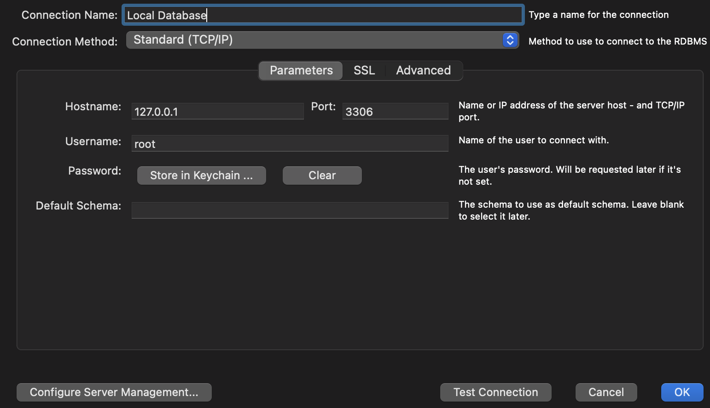

# Docker

Download and install Docker Desktop:

## Download and Install

* [Docker WebSite](https://docs.docker.com/desktop/)
* [MySql WorkBench](https://dev.mysql.com/downloads/workbench/)


## Setup Docker Image for MySql

* [Docker Hub Mysql Image](https://hub.docker.com/_/mysql) 

### Windows or Non M1 macs
```
docker run --name local-database -e MYSQL_ROOT_PASSWORD=clean-code -p 3306:3306 -d mysql:latest
```

### M1 Macs

```
docker run --name local-database -e MYSQL_ROOT_PASSWORD=clean-code -p 3306:3306 -d amd64/mysql:latest
```

## Log into Workbench




| Previous              | Current      | Next                           |
|-----------------------|--------------|--------------------------------|
| [Intro](../ReadMe.md) | Docker Setup | [Sql and Crud](02-SQL-CRUD.md) |