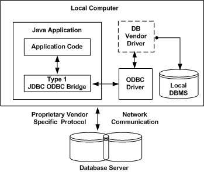
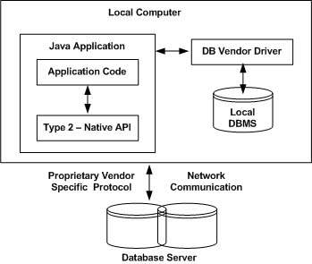
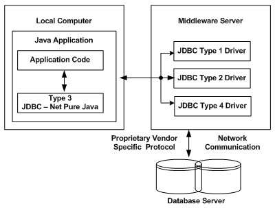
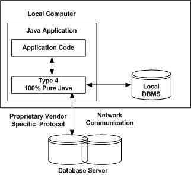

# JDBC - Driver Types

## What is JDBC Driver?

JDBC drivers implement the defined interfaces in the JDBC API, for interacting with your database server.

For example, using JDBC drivers enable you to open database connections and to interact with it by sending SQL or database commands then receiving results with Java.

The Java.sql package that ships with JDK, contains various classes with their behaviours defined and their actual implementaions are done in third-party drivers. Third party vendors implements the java.sql.Driver interface in their database driver.

## JDBC Drivers Types

JDBC driver implementations vary because of the wide variety of operating systems and hardware platforms in which Java operates. Sun has divided the implementation types into four categories, Types 1, 2, 3, and 4, which is explained below −

## Type 1 − JDBC-ODBC Bridge Driver

In a Type 1 driver, a JDBC bridge is used to access ODBC drivers installed on each client machine. Using ODBC, requires configuring on your system a Data Source Name (DSN) that represents the target database.

When Java first came out, this was a useful driver because most databases only supported ODBC access but now this type of driver is recommended only for experimental use or when no other alternative is available.

The JDBC-ODBC Bridge that comes with JDK 1.2 is a good example of this kind of driver.

## Type 2 − JDBC-Native API

In a Type 2 driver, JDBC API calls are converted into native C/C++ API calls, which are unique to the database. These drivers are typically provided by the database vendors and used in the same manner as the JDBC-ODBC Bridge. The vendor-specific driver must be installed on each client machine.

If we change the Database, we have to change the native API, as it is specific to a database and they are mostly obsolete now, but you may realize some speed increase with a Type 2 driver, because it eliminates ODBC's overhead.

## Type 3 − JDBC-Net pure Java

n a Type 3 driver, a three-tier approach is used to access databases. The JDBC clients use standard network sockets to communicate with a middleware application server. The socket information is then translated by the middleware application server into the call format required by the DBMS, and forwarded to the database server.

This kind of driver is extremely flexible, since it requires no code installed on the client and a single driver can actually provide access to multiple databases.

You can think of the application server as a JDBC "proxy," meaning that it makes calls for the client application. As a result, you need some knowledge of the application server's configuration in order to effectively use this driver type.

Your application server might use a Type 1, 2, or 4 driver to communicate with the database, understanding the nuances will prove helpful.

## Type 4 − 100% Pure Java

In a Type 4 driver, a pure Java-based driver communicates directly with the vendor's database through socket connection. This is the highest performance driver available for the database and is usually provided by the vendor itself.

This kind of driver is extremely flexible, you don't need to install special software on the client or server. Further, these drivers can be downloaded dynamically.

MySQL's Connector/J driver is a Type 4 driver. Because of the proprietary nature of their network protocols, database vendors usually supply type 4 drivers.

## Which Driver should be Used?

If you are accessing one type of database, such as Oracle, Sybase, or IBM, the preferred driver type is 4.

If your Java application is accessing multiple types of databases at the same time, type 3 is the preferred driver.

Type 2 drivers are useful in situations, where a type 3 or type 4 driver is not available yet for your database.

The type 1 driver is not considered a deployment-level driver, and is typically used for development and testing purposes only.

| Previous                     | Current | Next                                |
|------------------------------|---------|-------------------------------------|
| [Sql and Crud](02-SQL-CRUD.md)  | Drivers | [Connections](04-SQL-Connection.md) |